# 洄游 · Anabasis

**一件可旋转的 3D 粒子形态场作品。** 60 000 个粒子在四种内置形态之间形变（鲸骨架 / 棱镜环 / 归潮字 / 星壳），外加第五种形态——**把你上传的图片、或随手敲下的任意长度文字，变成粒子**。屏幕空间故障带、景深雾化、拖拽旋转，全部装在一个单文件 HTML 里。

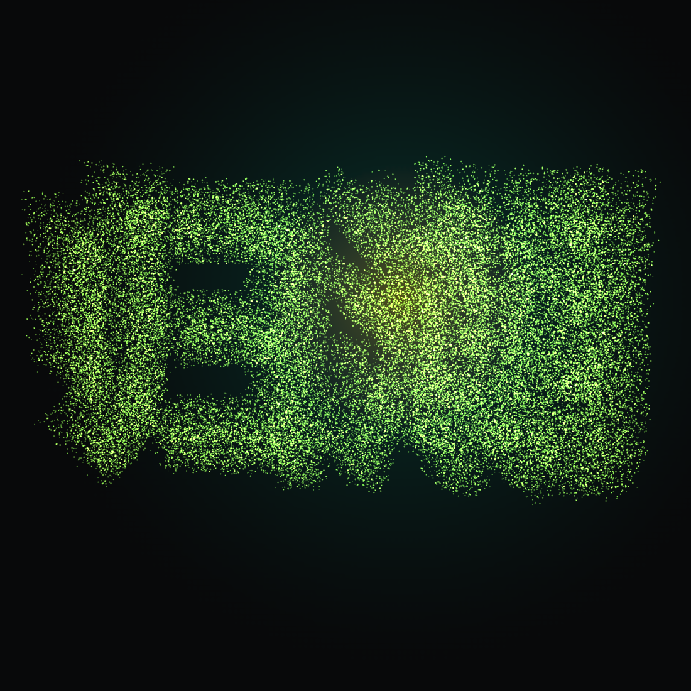

<p align="center">
  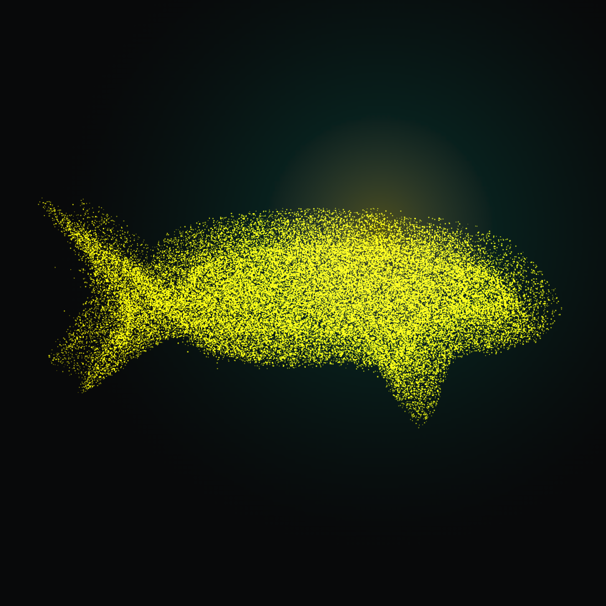 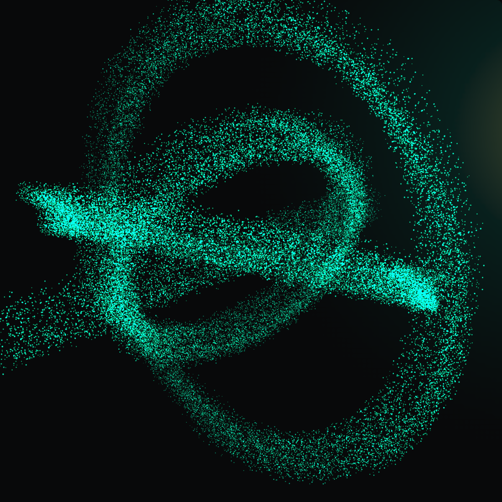 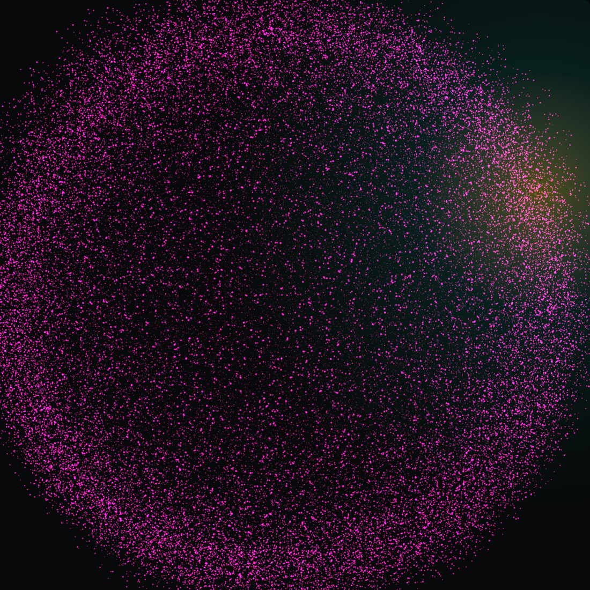 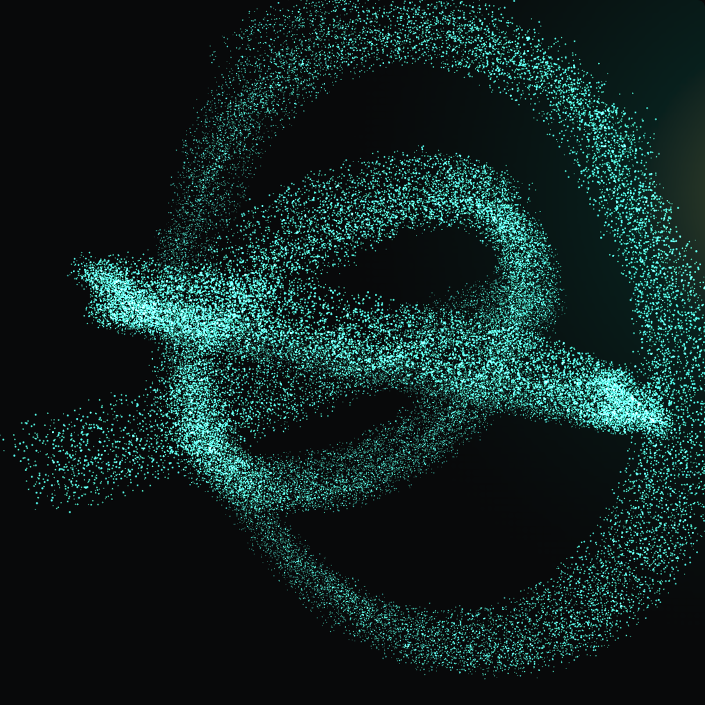
</p>

<p align="center">
  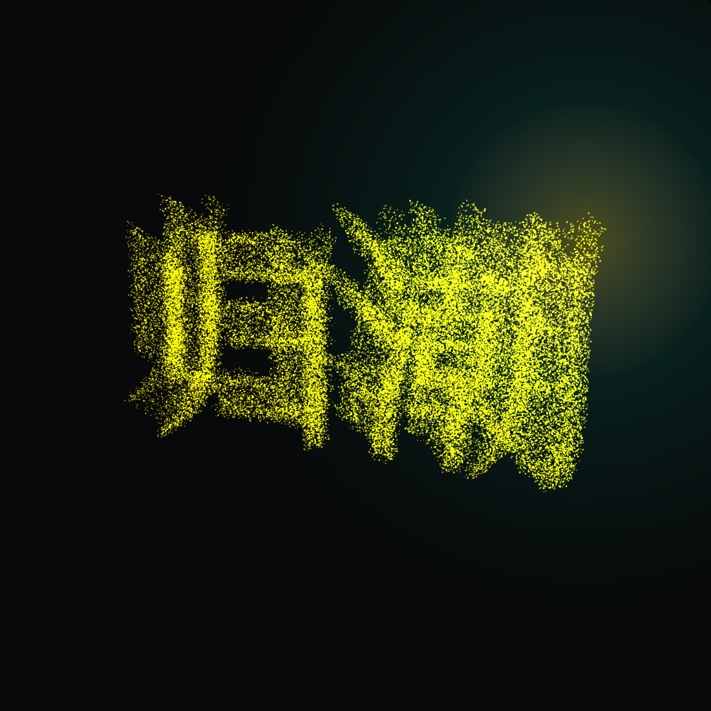 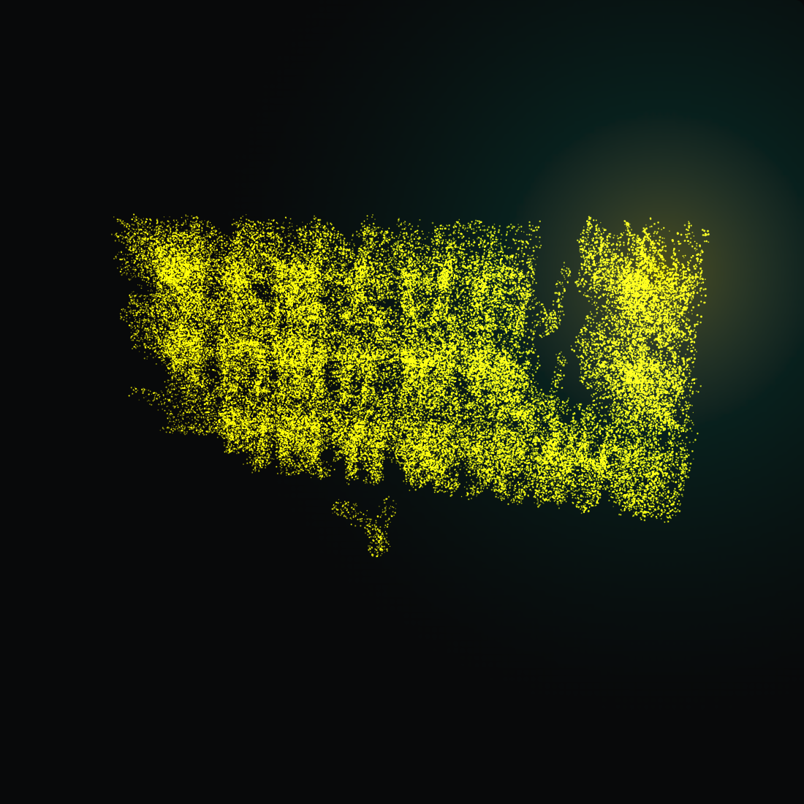 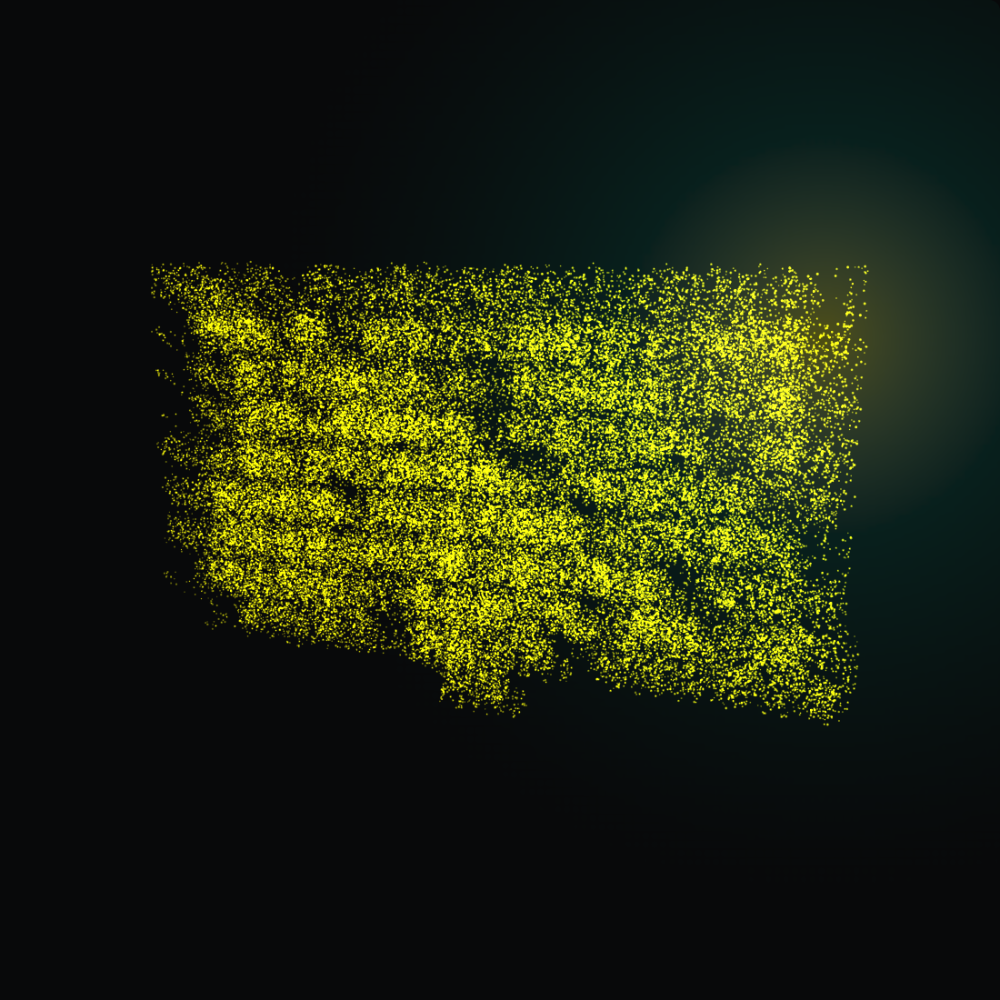 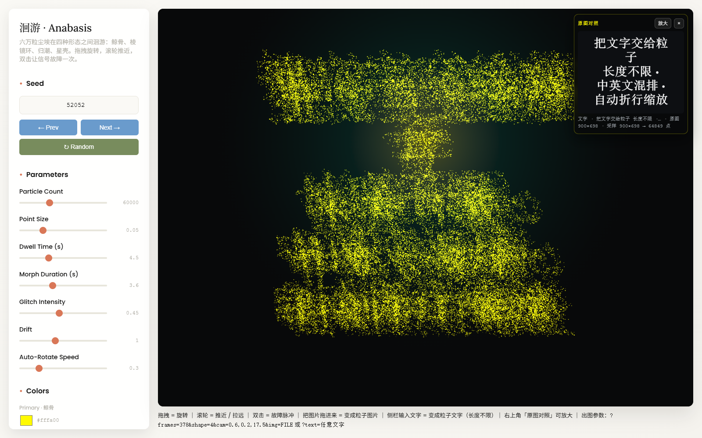
</p>
<p align="center"><sub>文字 → 粒子：两个字（字号自动放大）· 一句话 · 一整段（自动缩小折行）· 工作台界面</sub></p>

---

## 这是什么

一件生成艺术作品 + 一套可复现的渲染工具链。

- **形态不是建模出来的，是被"吸引"出来的。** 每个形态是一组目标坐标（骨骼曲线采样 / 环面参数方程 / 字形栅格 / 球壳分布），粒子在弹簧力 + 随机性下向目标收敛，形变过程本身就是作品的一部分。
- **图片是第五种形态。** 上传一张图（或拖进来、Ctrl+V 粘贴），程序把它按亮度阈值 / 透明通道 / 边缘检测识别成点云，并按亮度给出深度起伏，然后粒子从当前形态"游"过去变成它。
- **文字也是第五种形态。** 在侧栏敲进任意长度的一段话（一句诗、一段代码、一整页独白都行），程序自动排版：先按起始字号试排，太大就按 `min(可用高/块高, 可用宽/最宽行)` 迭代收缩，中文逐字断行、西文按词断行，再栅格化 → 采样 → 铺点。短句会自动放大到撑满取景框，长文自动缩小折行，永远不溢出。Ctrl/⌘+Enter 直接生成。
- **可旋转的实时场。** 拖拽旋转、滚轮缩放、双击触发故障带；不碰它的时候缓慢自转。
- **零构建、零依赖安装。** 单个 HTML 文件，three.js 走 CDN，双击即可运行。

### 形态循环

<p align="center">
  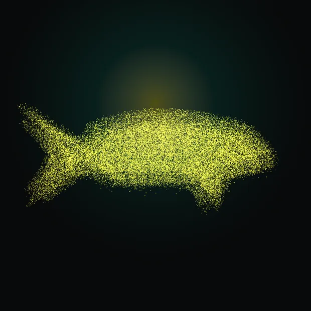 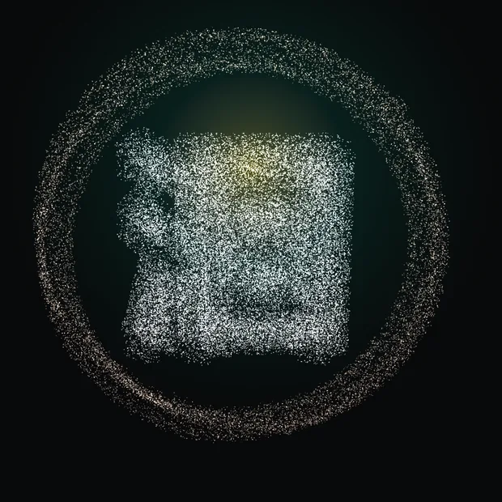
</p>

> 上面两张是动画（WebP 动图，48 帧 / 12fps / 无限循环）。GitHub 页面里能直接播放；接触印相图见 [`media/contact-sheet-whale.png`](media/contact-sheet-whale.png) 与 [`media/contact-sheet-image.png`](media/contact-sheet-image.png)。

---

## 快速开始

```bash
git clone git@github.com:240000000/anabasis.git
cd anabasis
# 直接双击打开（无需服务器）
start anabasis-3d.html      # Windows
open  anabasis-3d.html      # macOS
```

> 作品需要联网取 three.js（CDN）。要离线用，把 `<script src="...three.min.js">` 换成 `src/vendor/three.min.js` 并把文件放到 `vendor/` 即可。

如果想要分享链接或嵌进别的页面，用任意静态服务器：

```bash
python -m http.server 8000
# http://localhost:8000/anabasis-3d.html
```

---

## 操作方式

| 操作 | 效果 |
|---|---|
| 拖拽 | 旋转（松手后缓慢自转） |
| 滚轮 | 推近 / 拉远 |
| 双击画布 | 触发一次故障带 |
| 拖入图片 / Ctrl+V / 「图片」区上传 | 识别成粒子形态（自动锁定，避免被自动循环带走） |
| 侧栏「文字 → 粒子」敲字 → 「生成粒子文字」 | 任意长度文字排成粒子文字（Ctrl/⌘+Enter 亦可） |
| 侧栏「显示原图」 | 右上角浮出原图对照卡（可放大到 640px） |
| 侧栏「对比分屏」 | 左原图 / 右粒子，各占一半 |

侧栏可调：**种子**、粒子数、点大小、形变时长、停留时长、故障强度、漂移、自转速度，图片相关的 **模式（亮度/透明/边缘）**、阈值、采样精度、浮雕深度、**图片尺寸（贴合取景框）**、反色、原色、锁定，以及文字相关的 **起始字号 / 排版栅格精度 / 居中或左对齐**。三个取色器决定粒子配色。

**同一颗种子 + 同一组参数 = 同一件作品**（`randomSeed`/`noiseSeed` 全程种子化，无 `Math.random()`）。

---

## URL 参数（出图 / 分享用）

| 参数 | 例 | 作用 |
|---|---|---|
| `frames=N` | `?frames=210` | 同步跑完 N 帧后停住并置 `window.__READY__`（**定格渲染的必要条件**，否则截到随机中间帧） |
| `bare=1` | `?bare=1` | 只留画布，隐藏侧栏（纯作品图） |
| `shape=0..4` | `?shape=4` | 直接跳到某形态（0 鲸 / 1 环 / 2 字 / 3 星壳 / 4 图片） |
| `glitch=1` | `?glitch=1` | 强制开启故障带 |
| `cam=az,pol,dist` | `?cam=0.4,0.18,17.5` | 显式机位（一旦给定就关闭自转，方便复现） |
| `img=<url>` | `?img=file:///…/a.png` | 直接投喂图片（http(s) / file:// / data:），无需交互 |
| `text=` | `?text=归潮` | 直接投喂文字（任意长度，URL 编码），无需交互 |
| `tmax=` `tres=` `talign=` | `?text=hello&tmax=300&talign=left` | 文字起始字号 / 排版栅格宽度 / 对齐（center/left） |
| `src=0/1` | `?src=0` | 原图对照卡强制关/开 |
| `count=` `size=` | `?count=120000` | 粒子数 / 点大小 |
| `imode=` `thr=` `res=` | `?imode=edge&thr=90` | 图片识别模式 / 阈值 / 采样精度 |
| `relief=` `fit=` | `?relief=0&fit=0.82` | 浮雕深度 / 图片贴合取景框的占比 |
| `invert=1` `imgcolor=0` `imglock=1` | | 反色 / 单色粒子 / 锁定图片形态 |

---

## 工具链

仓库里的 `tools/` 是这套作品的**可复现出图与验收工具**，不是装饰：

| 工具 | 用途 |
|---|---|
| `tools/render-3d.mjs` | 定格出图：`node tools/render-3d.mjs anabasis-3d.html out.png "frames=210&shape=2" [canvas\|full]` |
| `tools/render-anim.mjs` | 出动画帧序列：单次会话内推进模拟并逐帧截图（48 帧 1100² 约 10 秒） |
| `tools/gifpack.py` | 帧目录 → GIF / 动态 WebP（Pillow） |
| `tools/sheet.py` | 帧目录 → 接触印相图（多帧拼一张静态图，便于在聊天/README 里展示运动） |
| `tools/probe-upload.mjs` | 真实上传图片并断言识别结果与状态行 |
| `tools/probe-image-controls.mjs` | 逐个点击面板控件，断言 12 步状态变化 |
| `tools/probe-text-ui.mjs` | 在侧栏**真的敲字**→点按钮/Ctrl+Enter/切对齐/滑杆/示例/清空，断言 6 步状态行与形态名，并出整页界面图 |
| `tools/probe-text-mask.mjs` | 无视觉通道时判字形对不对：把排版栅格与粒子点云**投影回同一张网格**打两张 ASCII 图对照 |
| `tools/ref-text-mask.py` | 独立参照渲染（Pillow + 系统字体，同一自动字号策略）→ 同规格 ASCII，用于第三方交叉验证 |
| `tools/probe-src.mjs` / `tools/probe-fill.mjs` | 布局与交互几何断言（画布填充比、卡片、分屏、无整页滚动） |
| `tools/analyze-art.mjs` | 零依赖 PNG 解码 → 亮度均值 / 亮部占比 / bbox / 12×12 密度图 |
| `tools/analyze-imgrows.mjs` | 反推每个粒子对应的图片像素，按行统计 z/y（排查取景溢出） |
| `tools/rows-profile.mjs` | 逐水平带亮度剖面（判断内容是否贴边） |
| `tools/probe-webgl.mjs` | 无头 WebGL 可用性探针（SwiftShader/ANGLE 自检） |
| `tools/check-live.mjs` | 线上部署端到端自检：`node tools/check-live.mjs https://…/anabasis-3d.html [out.png]`（断言粒子数 / 形态 / 画布尺寸 / 无 pageerror） |

工具默认用本机路径找浏览器；换机器时设 `PUPPETEER_CORE`（指向 `puppeteer-core` 包）与 `EDGE_PATH`（指向 Chrome/Edge 可执行文件）即可，或在仓库里 `npm i puppeteer-core`。

修改作品源码的流程：编辑 `src/_sketch.js` → `node src/splice.mjs anabasis-3d.html src/_sketch.js`（把源码重新注入单文件 HTML）。

---

## 技术要点

**点云着色器**（对标 [endfield.hypergryph.com/#lore](https://endfield.hypergryph.com/#lore) 反解出的结构）

```glsl
float viewZ = -mvPosition.z;
float distanceAlpha = 1.0 - clamp((viewZ - cameraFadeStart) / (cameraFadeDistance - cameraFadeStart), 0.0, 1.0);
vAlpha = 0.6 * alpha * distanceAlpha * (-0.25 * layer + 1.25) * pointActive;
gl_PointSize = size * pointSizeScale * distanceAlpha + 4.0;
```

- **故障带**：4 条水平带，`|mvPosition.y - gy| < glitchYRange` 时 `mvPosition.x += glitchXOffset * gx`。
- **点精灵**：`gl_PointCoord` 圆形掩膜 + 核心/羽化/内辉光三段，越界 `discard`。
- **形态形变**：`pos = mix(src, target, progress)`，权重向量 5 维（四形态 + 图片权重单独一路）。
- **图片识别**：图片最长边缩到 `imgRes`（默认 240）后逐像素判定，样本数 > 粒子数时种子化洗牌取前 n；边缘模式用 Sobel（幅值 ×63.75 拉到与阈值同量纲）。
- **文字排版**：排版栅格宽高比跟着取景框走（`AR = clamp(camera.aspect × 0.96, 0.7, 3.4)`），起点字号 `txtMaxSize`（默认 220），每轮按 `k = min(可用高 / 块高, 可用宽 / 最宽行)` 收缩（单轮限幅 0.45–2.4，`|k−1| < 0.015` 收敛，字号硬界 6–1400）；中文逐字断行、西文按词断行；栅格按透明通道（`imgMode=alpha`）采样，精度由 `txtRes`（默认 900，上限 1024）决定，优先于图片的 `imgRes`。
- **取景贴合**：可见半高 `= tan(fov/2) × 相机距离`（fov 46 / 距离 17.5 → 7.43 世界单位），铺图按 `imgFit`（0.82）乘进去，所以图片永远落在框内；画布尺寸变化时重算。
- **全屏工作台**：画布按容器实时算尺寸（`sizeToArea()`），出图模式恒钉 1100×1100 正方形以保住定格契约。

**无视觉通道也能验收**：每张静帧都用 `analyze-art.mjs` 打分（亮度均值 / 亮部占比 / bbox），例如 `frames=210`：鲸 35.2 / 0.165、环 29.9 / 0.173、字 39.3 / 0.226、星壳 24.4 / 0.183、形变 33.5 / 0.218、故障 32.1 / 0.181（1100×1100）。图片识别覆盖比实测：边缘 6733 / 亮度 13213 / 透明 57600 点（240² 全选）。文字形态三档：两字 `34.71 / 0.186`、一句话 `34.85 / 0.189`、一整段 `35.48 / 0.208`，亮部 bbox 均落在 1100² 画布内（x 152–1064、y 213–798）。

**字形对不对，用两条独立渲染链交叉验证**：`probe-text-mask.mjs` 在无头页面里同时打印「排版栅格 alpha」与「粒子点云按 `px = p/s + w/2` 反投影」两张 ASCII 图（96×44），两者应逐格同形；`ref-text-mask.py` 再用 Pillow + 系统字体按同一自动字号策略独立渲染第三张 —— 三方一致才算字形正确（`msyh`/`SimSun` 缺字、字体回退导致豆腐块在 ASCII 里一眼可见）。

---

## 目录结构

```
anabasis-3d.html          作品本体（单文件，可直接打开 / 可做 GitHub Pages 入口）
tidal-condensation.html   前作《归潮》：p5.js 2D 粒子流场（鲸形由流场凝出）
index.html                落地页（GitHub Pages 用）
src/_sketch.js            真源（three.js + GLSL），改动后 splice 回 HTML
src/splice.mjs            注入工具
tools/                    出图 / 验收 / 打包工具（见上表）
docs/GUIDE_洄游.md         算法哲学与实现笔记
docs/GUIDE_归潮.md         前作的算法哲学
media/                    成品图、动图、接触印相图
examples/test-image.png   演示用输入图
```

---

## 许可

代码与图像均以 [MIT](LICENSE) 许可发布。three.js 为 MIT（CDN 引用）；作品配色参考与着色器结构分析来自对公开站点 bundle 的解读，仅用于学习与致敬，未包含其任何素材资产。

## 致谢

- [three.js](https://threejs.org/) — 点云与自定义着色器
- [p5.js](https://p5js.org/) — 前作《归潮》
- 《洄游 · Anabasis》的名字与「形态不是画出来的、是被吸引出来的」这一取向，来自一次关于迁徙的思考。
